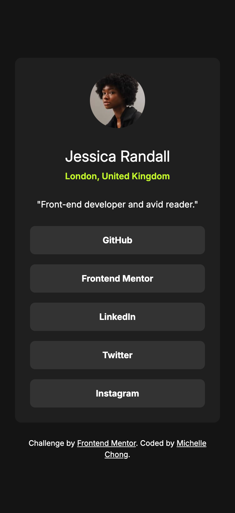
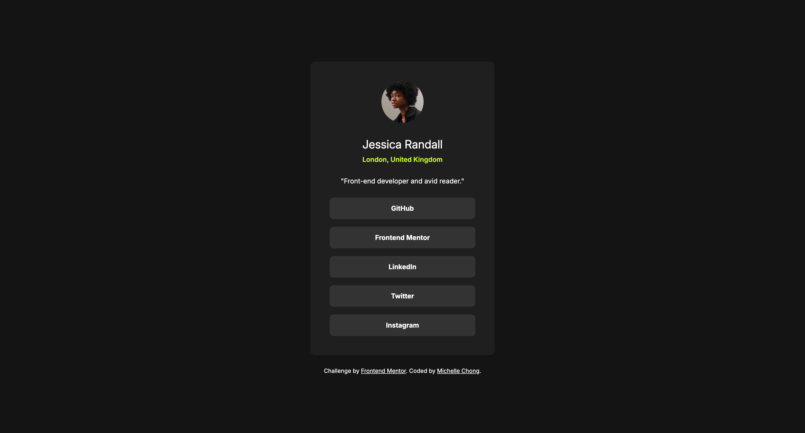

# Frontend Mentor - Social links profile solution

This is a solution to the [Social links profile challenge on Frontend Mentor](https://www.frontendmentor.io/challenges/social-links-profile-UG32l9m6dQ). Frontend Mentor challenges help you improve your coding skills by building realistic projects. 

## Table of contents

- [Overview](#overview)
  - [The challenge](#the-challenge)
  - [Screenshot](#screenshot)
  - [Links](#links)
- [My process](#my-process)
  - [Built with](#built-with)
  - [What I learned](#what-i-learned)
  - [Continued development](#continued-development)
  - [Useful resources](#useful-resources)
- [Author](#author)
- [Acknowledgments](#acknowledgments)

**Note: Delete this note and update the table of contents based on what sections you keep.**

## Overview

### The challenge

Users should be able to: 
- View the author's social media through the given links!
- Hover and see focus states change to a different color font and background color
- Able to see on both web and mobile

### Screenshot

- Mobile

- Desktop

### Links

- Solution URL: https://www.frontendmentor.io/solutions/social-links-profile-3x7vakC_OD 
- Live Site URL: https://mdchong.github.io/social-links-profile/

## My process

### Built with

- Semantic HTML5 markup
- CSS Reset
- Flexbox
- Mobile-first workflow approach
- Mobile-first workflow

### What I learned
Using body and main to align the card in the center! 

### Continued development
Constantly practice and truly understand how flex works and how to use them in real-world projects.

## Author

- Website - https://github.com/mdchong
- Frontend Mentor - https://www.frontendmentor.io/profile/mdchong
